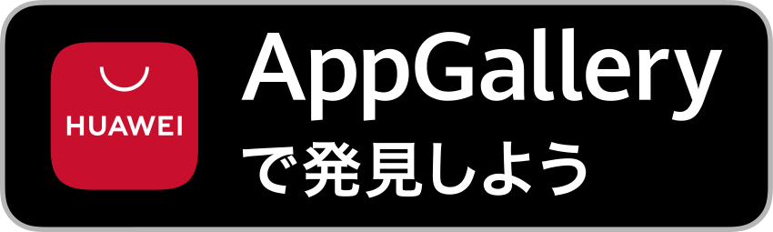

## 重要なお知らせ
貴重なお客様へ、

2024年1月23日より、弊社アプリがThe Pokémon Companyの知的財産権侵害の申し立てによりGoogle Playからの配信が停止されましたことをお知らせいたします。そのため、無期限でのダウンロードや使用ができなくなります。

弊社アプリに対して示していただいたサポートと熱意に深く感謝いたします。私たちのチームは、法的および知的財産の観点を尊重しながら、ポケモンファンコミュニティに引き続きサービスを提供する方法を模索しています。

現在、この停止はGoogle Playでの弊社アプリの利用可能性にのみ影響しています。アプリは現時点でiOSアップストアおよびHuaweiアプリギャラリーで引き

続きアクセス可能です。

この困難な時期に理解と継続的なサポートをいただき、心より感謝申し上げます。

<a href="https://apps.apple.com/us/app/pocket-gallery-app/id6464266038">

</a>

<!-- <a href="https://play.google.com/store/apps/details?id=com.eurekaffeine.pokedex">

</a> -->

<a href="https://url.cloud.huawei.com/nlFEFYg8Cc?shareTo=qrcode">

</a>

\
